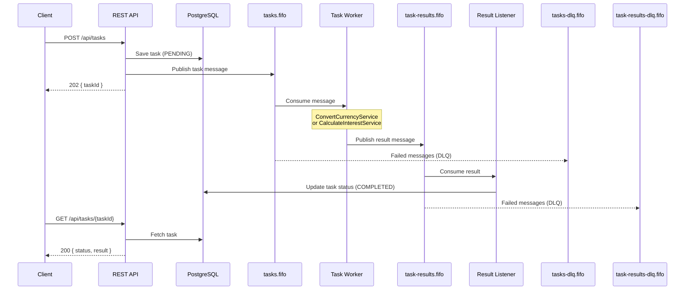

# Async Dispatch - Distributed Task Processing System

A Spring Boot application demonstrating scalable task processing using AWS SQS FIFO queues and PostgreSQL, with LocalStack for local development.

## Architecture

The system consists of two main components:

- **Task Manager**: REST API for task submission and status retrieval
- **Task Converter**: Worker service that processes tasks from SQS queues



## Prerequisites

- Java 21+
- Docker & Docker Compose
- Gradle 8.x


## Technology Stack

- **Spring Boot 3.4.5** - Application framework
- **Spring Cloud AWS SQS 3.1.1** - SQS integration
- **PostgreSQL 17** - Database
- **Hibernate 6.6** - ORM
- **LocalStack** - Local AWS services
- **Terraform** - Infrastructure as Code
- **Docker Compose** - Local development environment

## Project Structure

```
async-dispatch/
├── src/main/java/dev/eduardo/async_dispatch/
│   ├── common/                    # Shared domain and messages
│   │   ├── domain/
│   │   │   └── TaskType.java
│   │   └── sqs/
│   │       ├── CalculateInterestMessage.java
│   │       └── ConvertCurrencyMessage.java
│   ├── taskmanager/              # Task Manager module
│   │   ├── api/                  # REST controllers
│   │   ├── domain/               # Entities and repositories
│   │   └── service/              # Business logic and SQS producers
│   └── taskconverter/            # Task Converter module
│       └── service/              # Task processing and SQS consumers
├── infrastructure/
│   ├── localstack/               # LocalStack initialization
│   │   └── init-sqs.sh
│   └── terraform/                # Production infrastructure
│       ├── main.tf
│       ├── rds.tf
│       ├── variables.tf
│       └── outputs.tf
└── docker-compose.yml            # Local development setup
```


## 1. Setup Instructions

### 1.1 Clone and Build

```bash
cd async-dispatch
./gradlew clean build
```

### 1.2 Start Infrastructure

```bash
docker-compose up -d
```

This starts:
- **PostgreSQL 17** on port `5432`
- **LocalStack SQS** on port `4566` with FIFO queues

> **📘 For detailed LocalStack configuration and testing commands, see [README-LOCALSTACK.md](README-LOCALSTACK.md)**

## 2. Run Both Applications

Currently, running the main application with initialize both the `TaskManager` module and the `TaskConverter`.

### Option A: Run from IDE

#### Task Manager (Port 8080)
1. Open the project in IntelliJ IDEA
2. Run `ScalableTestApplication.java`
3. The application will start on `http://localhost:8080`

### Option B: Run from Command Line

```bash
./gradlew bootRun
```

### Verify Applications are Running

```bash
# Task Manager health check
curl http://localhost:8080/actuator/health
```

## 3. API Usage Examples

### 3.1 Submit Currency Conversion Task

```bash
curl -X POST http://localhost:8080/api/tasks \
  -H "Content-Type: application/json" \
  -d '{
    "type": "convert_currency",
    "payload": {
      "amount": 100.00,
      "fromCurrency": "EUR",
      "toCurrency": "USD"
    }
  }'
```

**Response:**

The created task ID. Use this ID to make the `GET` request

```json
{
  "taskId": "8e87f12d-57b3-49af-b1cf-7b7df136955b"
}
```

### 3.2 Submit Interest Calculation Task

```bash
curl -X POST http://localhost:8080/api/tasks \
  -H "Content-Type: application/json" \
  -d '{
    "type": "calculate_interest",
    "payload": {
      "principal": 1000.00,
      "annualRate": 5.5,
      "days": 90
    }
  }'
```

**Response:**

The created task ID. Use this ID to make the `GET` request

```json
{
  "taskId": "a1b2c3d4-e5f6-7890-abcd-ef1234567890"
}
```

### 3.3 Get Task Status and Result

```bash
curl http://localhost:8080/api/tasks/{taskId}
```

Replace `{taskId}` with the ID from the submission response.

**Response (Pending):**
```json
{
  "id": "8e87f12d-57b3-49af-b1cf-7b7df136955b",
  "type": "convert_currency",
  "payload": {
    "amount": 100.0,
    "fromCurrency": "EUR",
    "toCurrency": "USD"
  },
  "result": null,
  "status": "PENDING"
}
```

**Response (Completed):**
```json
{
  "id": "8e87f12d-57b3-49af-b1cf-7b7df136955b",
  "type": "convert_currency",
  "payload": {
    "amount": 100.0,
    "fromCurrency": "EUR",
    "toCurrency": "USD"
  },
  "result": "110.00",
  "status": "COMPLETED"
}
```

## Supported Task Types

### Convert Currency
Converts an amount from one currency to another using mock exchange rates.

**Supported currencies:** EUR, USD, GBP (Currently those are mocks. In a real environment, we could support many more currencies)

**Payload:**
- `amount` (Double): Amount to convert
- `fromCurrency` (String): Source currency code
- `toCurrency` (String): Target currency code

### Calculate Interest
Calculates simple interest for a given principal, rate, and time period.

**Formula:** Interest = Principal × Rate × (Days / 365)

**Payload:**
- `principal` (Double): Principal amount
- `annualRate` (Double): Annual interest rate (as percentage, e.g., 5.5 for 5.5%)
- `days` (Integer): Number of days

## Configuration

### Local Development (application.properties)

```properties
# Database
spring.datasource.url=jdbc:postgresql://localhost:5432/async_dispatch
spring.datasource.username=postgres
spring.datasource.password=postgres

# AWS/SQS
spring.cloud.aws.region.static=us-east-1
spring.cloud.aws.endpoint=http://localhost:4566
spring.cloud.aws.sqs.tasks-queue-url=http://localhost:4566/000000000000/tasks.fifo
spring.cloud.aws.sqs.task-results-queue-url=http://localhost:4566/000000000000/task-results.fifo
```

### Production Deployment

For production deployment using Terraform:

1. Navigate to the Terraform directory:
```bash
cd infrastructure/terraform
```

2. Create `terraform.tfvars`:
```hcl
aws_region     = "us-east-1"
aws_access_key = "your-access-key"
aws_secret_key = "your-secret-key"
aws_account_id = "123456789012"
environment    = "prod"

# RDS Configuration
vpc_id              = "vpc-xxxxx"
db_subnet_ids       = ["subnet-xxxxx", "subnet-yyyyy"]
allowed_cidr_blocks = ["10.0.0.0/16"]
db_username         = "dbadmin"
db_password         = "secure-password"
```

3. Deploy infrastructure:
```bash
terraform init
terraform validate
terraform plan
terraform apply
```

4. Update application properties with production values from Terraform outputs.

## Monitoring

### View Application Logs

```bash
# Task Manager logs
tail -f logs/task-manager.log

# Task Converter logs
tail -f logs/task-converter.log
```

### Monitor SQS Queues

See [README-LOCALSTACK.md](README-LOCALSTACK.md) for detailed SQS monitoring commands.

### Check Database

```bash
# Connect to PostgreSQL
docker exec -it async-dispatch-postgres psql -U postgres -d async_dispatch

# View tasks
SELECT id, type, status, created_at FROM tasks ORDER BY created_at DESC LIMIT 10;

# View task results
SELECT tr.id, tr.result, t.type, tr.created_at 
FROM "task-results" tr 
JOIN tasks t ON tr.task_id = t.id 
ORDER BY tr.created_at DESC LIMIT 10;
```

### Tasks stuck in PENDING status

Check that the Task Converter application is running and consuming from the queue.

For SQS message verification and DLQ monitoring, see [README-LOCALSTACK.md](README-LOCALSTACK.md).

## Considerations

- Both modules (TaskManager and TaskConverter) are running inside the same application. Ideally we should split those modules so we can be able to run them separately. This is required for better performance and scalability
- The `TaskConverter` is not reliable in the current state. Any errors that can happen while executing the tasks we would lose the data. It need some kind of retrying capabilities.
- Considering that I am in the Application Framework team:
  - Keep the authorization/authentication outside the application. That should be centralized on the organization level to avoid any security issues.
  - Create a template for the terraform deployment introducing some constraints. We should give the teams liberty to deploy their own application, but with some guard-rails (i.e. aws region, database versions)