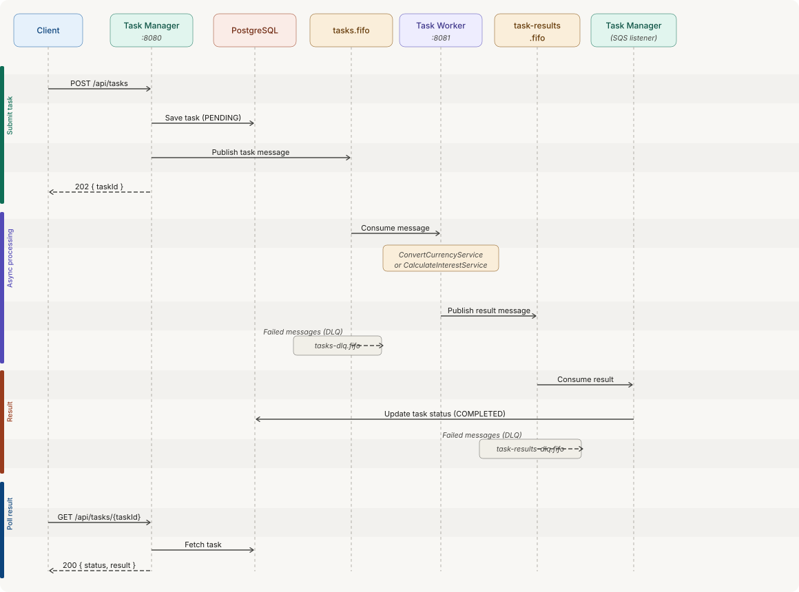
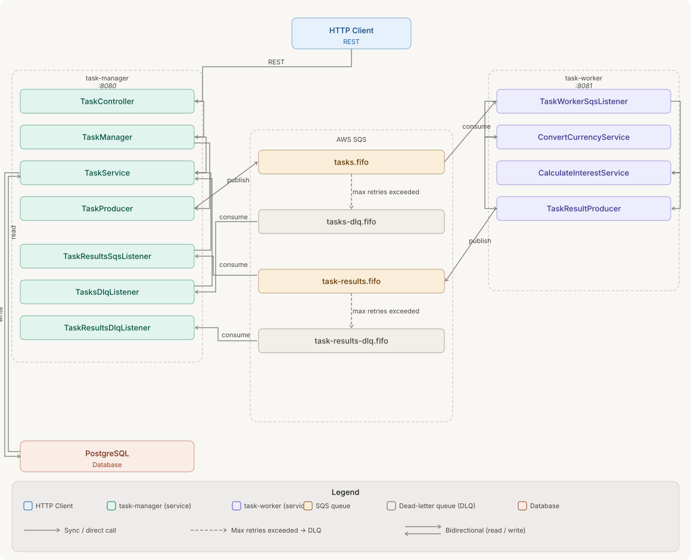

# Async Dispatch — Distributed Task Processing System

A Spring Boot system demonstrating scalable async task processing using AWS SQS FIFO queues and PostgreSQL, structured as independently deployable microservices with production-grade Kubernetes delivery.

## Architecture

The repository is a multi-module Gradle monorepo with three subprojects:

| Module | Role |
|--------|------|
| **common** | Shared library — message DTOs and `TaskType` enum |
| **task-manager** | REST API for task submission and status retrieval; persists state to PostgreSQL |
| **task-worker** | SQS consumer; processes tasks and publishes results back via a second queue |



### Component Overview



## Technology Stack

| Component | Technology |
|-----------|-----------|
| Framework | Spring Boot 3.5.10 |
| SQS integration | Spring Cloud AWS 3.1.1 |
| Database | PostgreSQL 17 |
| Schema migrations | Flyway |
| ORM | Hibernate 6.6 |
| Local AWS | LocalStack |
| Container orchestration | Kubernetes (Helm + Kustomize) |
| Autoscaling | KEDA (SQS queue-depth) · HPA (CPU) |
| Infrastructure | Terraform |
| Runtime | Java 21 |

## Project Structure

```
async-dispatch/
├── common/                        # Shared library
│   └── src/main/java/.../common/
│       ├── domain/TaskType.java
│       └── sqs/                   # Message DTOs
├── task-manager/                  # REST API service
│   ├── Dockerfile
│   └── src/main/
│       ├── java/.../taskmanager/
│       │   ├── api/               # Controllers, request/response types
│       │   ├── config/            # AwsConfig (IRSA-aware)
│       │   ├── domain/            # JPA entities, repository
│       │   └── service/           # Business logic, SQS producers & listeners
│       └── resources/
│           ├── application.properties
│           └── db/migration/      # Flyway migrations
├── task-worker/                   # SQS worker service
│   ├── Dockerfile
│   └── src/main/java/.../taskworker/
│       ├── config/                # AwsConfig (IRSA-aware)
│       └── service/               # Task processors, SQS listener & producer
├── helm/
│   ├── task-manager/              # Helm chart (HPA, PDB, IRSA ServiceAccount)
│   └── task-worker/               # Helm chart (KEDA ScaledObject, PDB, IRSA ServiceAccount)
├── k8s/overlays/
│   ├── dev/                       # Kustomize overlay — LocalStack, minimal resources
│   └── prod/                      # Kustomize overlay — real SQS, higher replicas
├── infrastructure/
│   ├── localstack/init-sqs.sh     # Auto-creates FIFO queues on LocalStack startup
│   └── terraform/                 # SQS queues + RDS PostgreSQL
└── docker-compose.yml             # Full local stack (Postgres, LocalStack, both services)
```

## Quick Start

### Prerequisites

- Java 21+
- Docker & Docker Compose

### 1. Start the full stack

```bash
docker-compose up -d
```

This starts PostgreSQL, LocalStack (SQS), task-manager on port `8080`, and task-worker on port `8081`. LocalStack automatically creates all four FIFO queues on startup.

### 2. Verify both services are healthy

```bash
curl http://localhost:8080/actuator/health   # task-manager
curl http://localhost:8081/actuator/health   # task-worker
```

### 3. Browse the API

Swagger UI: [http://localhost:8080/swagger-ui.html](http://localhost:8080/swagger-ui.html)

## API Usage

### Submit a currency conversion task

```bash
curl -X POST http://localhost:8080/api/tasks \
  -H "Content-Type: application/json" \
  -d '{
    "type": "convert_currency",
    "payload": {
      "amount": 100.00,
      "fromCurrency": "EUR",
      "toCurrency": "USD"
    }
  }'
```

```json
{ "taskId": "8e87f12d-57b3-49af-b1cf-7b7df136955b" }
```

### Submit an interest calculation task

```bash
curl -X POST http://localhost:8080/api/tasks \
  -H "Content-Type: application/json" \
  -d '{
    "type": "calculate_interest",
    "payload": {
      "principal": 1000.00,
      "annualRate": 5.5,
      "days": 90
    }
  }'
```

### Poll for the result

```bash
curl http://localhost:8080/api/tasks/{taskId}
```

**Pending:**
```json
{ "id": "...", "type": "convert_currency", "status": "PENDING", "result": null }
```

**Completed:**
```json
{ "id": "...", "type": "convert_currency", "status": "COMPLETED", "result": "110.00" }
```

## Supported Task Types

| Type | Payload fields | Formula |
|------|---------------|---------|
| `convert_currency` | `amount`, `fromCurrency`, `toCurrency` | Static exchange rates (EUR, USD, GBP) |
| `calculate_interest` | `principal`, `annualRate` (%), `days` | Simple interest: P × R × (days / 365) |

## Running Locally (without Docker)

Build all modules:

```bash
./gradlew build
```

Start infrastructure only:

```bash
docker-compose up -d postgres localstack
```

Run each service in a separate terminal:

```bash
# task-manager
AWS_ENDPOINT_URL=http://localhost:4566 AWS_ACCESS_KEY_ID=test AWS_SECRET_ACCESS_KEY=test \
DB_URL=jdbc:postgresql://localhost:5432/async_dispatch DB_USERNAME=postgres DB_PASSWORD=postgres \
./gradlew :task-manager:bootRun

# task-worker
AWS_ENDPOINT_URL=http://localhost:4566 AWS_ACCESS_KEY_ID=test AWS_SECRET_ACCESS_KEY=test \
./gradlew :task-worker:bootRun
```

## Kubernetes Deployment

Each service has a Helm chart. Use the Kustomize overlays to render and apply them:

```bash
# Preview
kubectl apply -k k8s/overlays/prod --dry-run=client

# Apply
kubectl apply -k k8s/overlays/prod
```

**task-worker** scales automatically based on SQS queue depth via [KEDA](https://keda.sh) — no manual scaling needed during bursts. **task-manager** uses a standard HPA (CPU-based).

Both services use IRSA (`eks.amazonaws.com/role-arn` on the `ServiceAccount`) — no hardcoded AWS credentials in production.

See [docs/infrastructure.md](docs/infrastructure.md) for the full Helm + Kustomize + KEDA setup.

## Infrastructure (Terraform)

```bash
cd infrastructure/terraform
cp terraform.tfvars.example terraform.tfvars  # fill in your values
terraform init && terraform apply
```

Creates: SQS FIFO queues (with DLQs) and RDS PostgreSQL. See [docs/infrastructure.md](docs/infrastructure.md) for details.

## Monitoring

```bash
# SQS queue depth (LocalStack)
aws --endpoint-url=http://localhost:4566 sqs get-queue-attributes \
  --queue-url http://localhost:4566/000000000000/tasks.fifo \
  --attribute-names ApproximateNumberOfMessages

# Database
docker exec -it async-dispatch-postgres psql -U postgres -d async_dispatch \
  -c "SELECT id, type, status, created_at FROM tasks ORDER BY created_at DESC LIMIT 10;"
```

Full actuator metrics are available at `/actuator/metrics` on both services.
