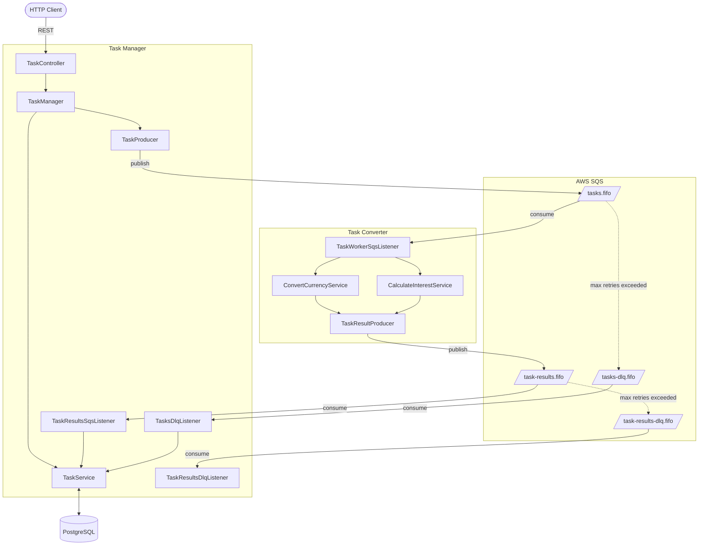
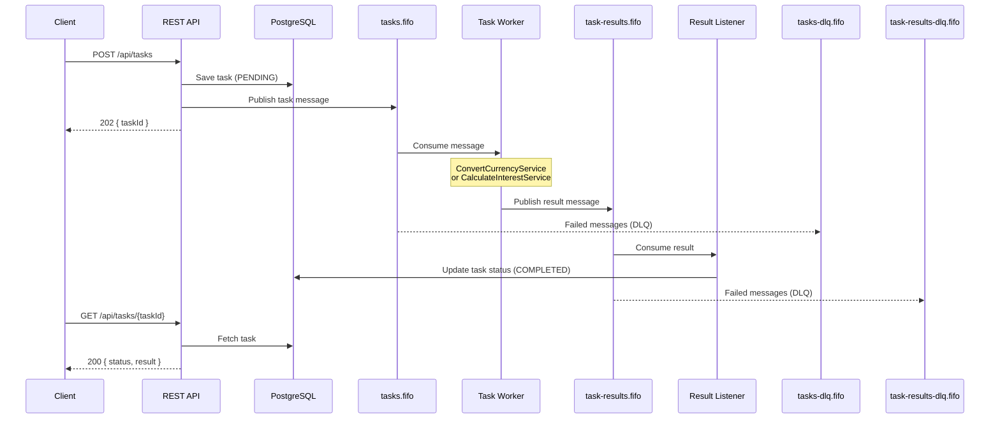

# Architecture

## System Overview

The application is composed of two logical modules that currently run inside a single Spring Boot process. The **Task Manager** exposes a REST API to accept tasks and query their status. The **Task Converter** is a background worker that consumes tasks from SQS, processes them, and publishes results back through a second queue.

### Component Overview

The diagram below shows all components within each module and how they relate to the external infrastructure.

## Task Processing Flow

This diagram shows the end-to-end lifecycle of a single task, from submission through processing to final status update.

