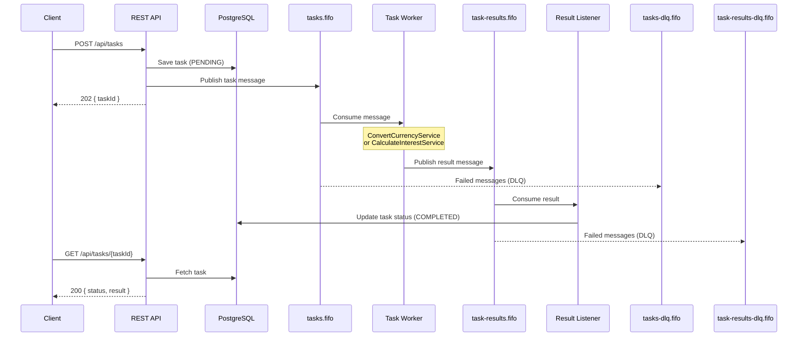
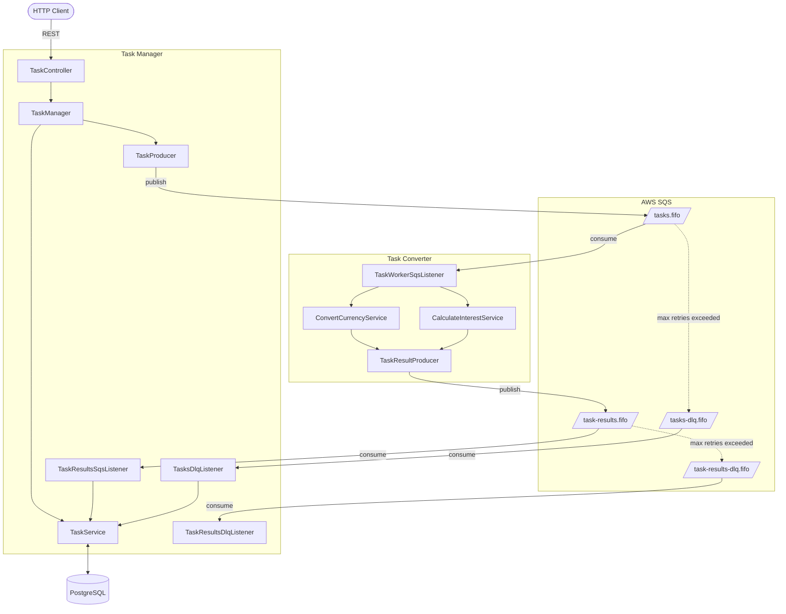

# Async Dispatch – Distributed Task Processing

A Spring Boot application demonstrating scalable asynchronous task processing using AWS SQS FIFO queues and PostgreSQL, with LocalStack for local development.

## Architecture

The system has two logical modules running in a single application:

- **Task Manager** – REST API for task submission and status retrieval
- **Task Converter** – Worker service that consumes tasks from SQS queues



### Component Overview



## Tech stack

| Component | Technology |
|-----------|-----------|
| Framework | Spring Boot 3.4.5 |
| SQS integration | Spring Cloud AWS 3.1.1 |
| Database | PostgreSQL 17 |
| ORM | Hibernate 6.6 |
| Local AWS | LocalStack |
| Infrastructure | Terraform |
| Runtime | Java 21 |

## Running locally

```bash
# Start PostgreSQL + LocalStack SQS
docker-compose up -d

# Run the application
./gradlew bootRun
```

## Supported task types

### `convert_currency`
Converts an amount between currencies using mock exchange rates (EUR, USD, GBP).

```json
{
  "type": "convert_currency",
  "payload": { "amount": 100.00, "fromCurrency": "EUR", "toCurrency": "USD" }
}
```

### `calculate_interest`
Calculates simple interest: `Interest = Principal × Rate × (Days / 365)`.

```json
{
  "type": "calculate_interest",
  "payload": { "principal": 1000.00, "annualRate": 5.5, "days": 90 }
}
```

## Known limitations & future improvements

- Both modules run in the same process — ideally they should be split for independent scaling
- No retry mechanism: failed tasks are lost
- Authorization/authentication should be handled at the platform level, not per-service
- Terraform templates should include guard-rails (region constraints, DB version policies)
